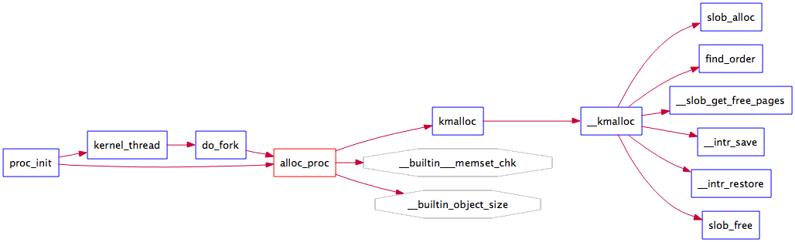
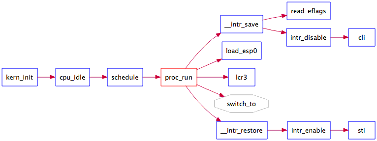

# Lab 4 实验报告

#### 2014011561 张欣阳

> 注：为了在mac下编译，修改了Makefile文件，如果不能编译，请使用Makefile.bk

--------------------------------------------------------------------------------

## 练习1：分配并初始化一个进程控制块

### alloc_proc 实现

在实现`alloc_proc`函数前，我们先分析一下他的功能和位置。它的调用关系如下：



它在`proc_init`函数中被调用，用于"硬创建"idleproc进程；也在`do_fork`中被调用，用于创建新的进程控制块。总结来看，它的功能就是创建并初始化新的进程控制块，相应地，也就对应于一个内核线程（一种特殊的进程）。在`alloc_proc`调用完后，一个进程应当处于"创建"状态，也就对应于ucore中PROC_UNINIT状态。

根据它的功能，我们将`alloc_proc`实现如下：

```c
static struct proc_struct *
alloc_proc(void) {
    struct proc_struct *proc = kmalloc(sizeof(struct proc_struct));
    if (proc != NULL) {
     proc->state = PROC_UNINIT;     // set state to UNINIT
     proc->pid = -1;                // set undetermined pid
     proc->runs = 0;
     proc->kstack = 0;
     proc->need_resched = 0;
     proc->parent = NULL;
     proc->mm = NULL;
     memset(&(proc->context), 0, sizeof(struct context));
     proc->tf = NULL;
     proc->cr3 = boot_cr3;      // set PDT to boot time PDT
     proc->flags = 0;
     memset(proc->name, 0, PROC_NAME_LEN);
    }
    return proc;
}
```

可以看到，进行的工作主要是初始化进程控制块数据结构`proc_struct`中各个字段。值得注意的是，状态`proc->state`赋值为PROC_UNINIT；PDT指针`proc->cr3`被赋值为启动初始化PDT变量boot_cr3

### 问题回答

**请说明proc_struct中struct context context和struct trapframe *tf成员变量含义和在本实验中的作用是啥？（提示通过看代码和编程调试可以判断出来）**

先来看`struct context context`，该结构体定义在`proc.h`中，代码如下：

```c
struct context {
    uint32_t eip;
    uint32_t esp;
    uint32_t ebx;
    uint32_t ecx;
    uint32_t edx;
    uint32_t esi;
    uint32_t edi;
    uint32_t ebp;
};
```

作用如同其名称，用于保存当前进程的上下文。在进程切换时，各个寄存器的值将被保存在这个字段中。与它有关的进程切换代码在`switch.S`中用汇编定义为过程`switch_to`，调用关系如下：


再来看`struct trapframe *tf`，这个结构体在lab1中就碰到过，用于中断处理，保存中断信息。在进程管理中，用于记录进程被打断时的执行信息，本实验创建子进程时正确设置trapframe，使得在切换后子进程能够正确被调度执行。

## 练习2：为新创建的内核线程分配资源

### do_fork 实现

先分析`do_fork`函数的功能和位置。它的调用关系如下：


在本实验中，还没有实现系统调用，所以`do_fork`函数仅仅会被kernel_thread函数调用，用于创建新进程。事实上，该函数在功能上对应于sys_fork系统调用，利用已有进程的控制信息，创建一个相同的新的进程。

根据其功能，实现`do_fork`如下：

```c
int
do_fork(uint32_t clone_flags, uintptr_t stack, struct trapframe *tf) {
    int ret = -E_NO_FREE_PROC;
    struct proc_struct *proc;
    if (nr_process >= MAX_PROCESS) {
        goto fork_out;
    }
    ret = -E_NO_MEM;
    //LAB4:EXERCISE2 2014011561

    //    1\. call alloc_proc to allocate a proc_struct
    if ((proc = alloc_proc()) == NULL) {
        cprintf("Cannot allocate proc\n");
        goto fork_out;
    }
    //    2\. call setup_kstack to allocate a kernel stack for child process
    if ((setup_kstack(proc) != 0)) {
        cprintf("Cannot allocate kernel stack\n");
        goto bad_fork_cleanup_proc;
    }
    //    3\. call copy_mm to dup OR share mm according clone_flag
    if (copy_mm(clone_flags, proc) != 0) {
        cprintf("Cannot copy mm structure\n");
        goto bad_fork_cleanup_kstack;
    }
    //    4\. call copy_thread to setup tf & context in proc_struct
    copy_thread(proc, stack, tf);
    //    5\. insert proc_struct into hash_list && proc_list

    // disable interrupt
    bool intr_flag;
    local_intr_save(intr_flag);
    {
        proc->pid = get_pid();
        hash_proc(proc);
        list_add(&proc_list, &(proc->list_link));
        nr_process++;
    }
    local_intr_restore(intr_flag);  // enable interrupt
    //    6\. call wakeup_proc to make the new child process RUNNABLE
    wakeup_proc(proc);
    //    7\. set ret vaule using child proc's pid
    ret = proc->pid;

fork_out:
    return ret;

bad_fork_cleanup_kstack:
    put_kstack(proc);
bad_fork_cleanup_proc:
    kfree(proc);
    goto fork_out;
}
```

具体步骤已经在注释中注明，有几点注意。首先，针对内存分配失败的处理，原代码框架中定义了`bad_fork_cleanup_kstack`，`bad_fork_cleanup_proc`这两个出口，在初始化内核栈之前，应当使用`bad_fork_cleanup_proc`出口，初始化以后，应当使用`bad_fork_cleanup_kstack`出口。其次，获取pid时，添加进程队列时应当关中断，防止被打断，关中断使用的方式是`local_intr_save`这个函数。

### 问题回答

**请说明ucore是否做到给每个新fork的线程一个唯一的id？请说明你的分析和理由**

可以做到，有如下保证：首先，为进程分配pid在`do_fork`函数中，相关代码重复如下：

```c
// disable interrupt
bool intr_flag;
local_intr_save(intr_flag);
{
    proc->pid = get_pid();
    hash_proc(proc);
    list_add(&proc_list, &(proc->list_link));
    nr_process++;
}
local_intr_restore(intr_flag);  // enable interrupt
```

由于关了中断，这一段代码不会被打断，可以保证顺序执行

再看`get_pid`的实现：

```c
static int
get_pid(void) {
    static_assert(MAX_PID > MAX_PROCESS);
    struct proc_struct *proc;
    list_entry_t *list = &proc_list, *le;
    static int next_safe = MAX_PID, last_pid = MAX_PID;
    if (++ last_pid >= MAX_PID) {
        last_pid = 1;
        goto inside;
    }
    if (last_pid >= next_safe) {
inside:
        next_safe = MAX_PID;
repeat:
        le = list;
        while ((le = list_next(le)) != list) {
            proc = le2proc(le, list_link);
            if (proc->pid == last_pid) {
                if (++ last_pid >= next_safe) {
                    if (last_pid >= MAX_PID) {
                        last_pid = 1;
                    }
                    next_safe = MAX_PID;
                    goto repeat;
                }
            }
            else if (proc->pid > last_pid && next_safe > proc->pid) {
                next_safe = proc->pid;
            }
        }
    }
    return last_pid;
}
```

get_pid利用静态变量维护了一段安全的可分配区间。需要时会遍历进程链表检查某个pid是否已经被分配以保证新分配的pid不会重复。

## 练习3：阅读代码，理解 proc_run 函数和它调用的函数如何完成进程切换的

### proc_run 分析

`proc_run`的调用关系如下：



本实验中，没有实现整合中断的进程调度，而是通过在`cpu_idle`函数中不断调用`schedule`函数实现进程调用。`schedule`函数选择下一个要执行的进程，并调用`proc_run`函数完成切换。

`proc_run`实现如下：

```c
void
proc_run(struct proc_struct *proc) {
    if (proc != current) {
        bool intr_flag;
        struct proc_struct *prev = current, *next = proc;
        local_intr_save(intr_flag);     // disable interrupt
        {
            current = proc;
            load_esp0(next->kstack + KSTACKSIZE);   // load next proc's kernel stack pointer
            lcr3(next->cr3);                        // load next proc's PDT pointer
            switch_to(&(prev->context), &(next->context));  // switch context
        }
        local_intr_restore(intr_flag);      // enable interrupt
    }
}
```

功能在注释中已经给出，首先完成的是栈指针和PDT的切换，然后调用汇编实现的switch_to，如下：

```asm
switch_to:                      # switch_to(from, to)

    # save from's registers
    movl 4(%esp), %eax          # eax points to from
    popl 0(%eax)                # save eip !popl
    movl %esp, 4(%eax)          # save esp::context of from
    movl %ebx, 8(%eax)          # save ebx::context of from
    movl %ecx, 12(%eax)         # save ecx::context of from
    movl %edx, 16(%eax)         # save edx::context of from
    movl %esi, 20(%eax)         # save esi::context of from
    movl %edi, 24(%eax)         # save edi::context of from
    movl %ebp, 28(%eax)         # save ebp::context of from

    # restore to's registers
    movl 4(%esp), %eax          # not 8(%esp): popped return address already
                                # eax now points to to
    movl 28(%eax), %ebp         # restore ebp::context of to
    movl 24(%eax), %edi         # restore edi::context of to
    movl 20(%eax), %esi         # restore esi::context of to
    movl 16(%eax), %edx         # restore edx::context of to
    movl 12(%eax), %ecx         # restore ecx::context of to
    movl 8(%eax), %ebx          # restore ebx::context of to
    movl 4(%eax), %esp          # restore esp::context of to

    pushl 0(%eax)               # push eip

    ret
```

完成的是寄存器的保存和切换

### 问题回答

**在本实验的执行过程中，创建且运行了几个内核线程？**

共有两个，idleproc负责不停地查询，看是否有其他内核线程可以执行了，如果有，马上让调度器选择那个内核线程执行；initproc输出"Hello World"

**语句local_intr_save(intr_flag);....local_intr_restore(intr_flag);在这里有何作用?请说明理由**

关闭中断和恢复中断，进程切换过程中不能被打断，不然会出现无法预料的后果

## 与参考答案的区别

本实验实现比较单一，和标准答案没有大的不同。

## 重要知识点

主要集中在`do_fork`的实现

- 分配并初始化进程控制块（alloc_proc函数）；
- 分配并初始化内核栈（setup_stack函数）；
- 根据clone_flag标志复制或共享进程内存管理结构（copy_mm函数）；
- 设置进程在内核（将来也包括用户态）正常运行和调度所需的中断帧和执行上下文（copy_thread函数）；
- 进程控制块放入hash_list和proc_list两个全局进程链表中；

## 未覆盖知识点

- fork系统调用实现（据说在下一个lab）
- 父进程和子进程（据说也在下一个lab）
