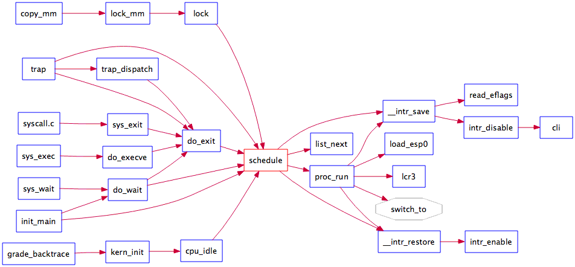
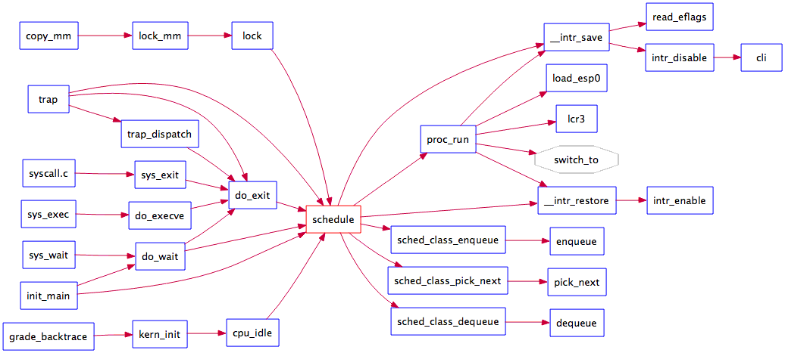
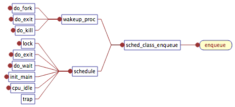
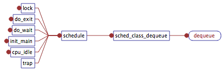
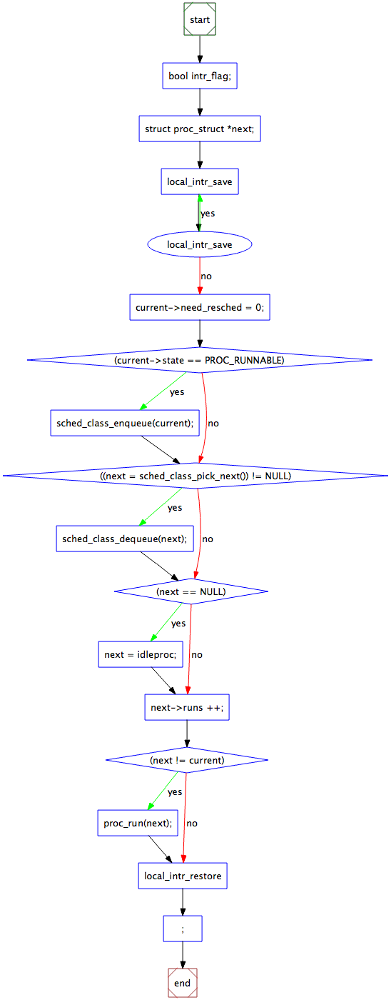

# Lab 5 实验报告

#### 2014011561 张欣阳

> 注：为了在mac下编译，修改了Makefile文件，如果不能编译，请使用Makefile.bk

--------------------------------------------------------------------------------

## 练习0：更新以往lab
第一处需要更新的地方是proc.c中`alloc_proc`函数，由于我们改进了proc_struct数据结构，所以新引入的字段需要初始化，更新如下：
```c
proc->rq = NULL;    // set running queue to NULL
list_init(&(proc->run_link));   // init run_link list
proc->time_slice = 0;
// for skew heap data structure, set parent, left, right pointer to NULL
proc->lab6_run_pool.left = proc->lab6_run_pool.right = proc->lab6_run_pool.parent = NULL;
proc->lab6_stride = 0;
proc->lab6_priority = 0;
```
running queue设置为NULL，run_link链表用`list_init`函数初始化。新引入的斜堆数据结构每个节点有三个字段，父节点、左孩子和右孩子，都设置为NULL。其余字段初始化为0。

第二处需要更新的地方是trap.c中的`trap_dispatch`函数。在上一个lab中，我们直接在时钟周期达到`TICK_NUM`的时候将`current->need_resched`设置为1；然而在本lab中，我们对idleproc和其他进程做区分处理。sched.c中定义了函数`sched_class_proc_tick`，在时间片用完时，对idleproc进程设置`need_resched`为1，而对一般进程调用`proc_tick`函数，处理时间片。我们在此利用这个函数，修改如下：
```c
assert(current != NULL);
sched_class_proc_tick(current);
```
同时我们对sched.c中的`sched_class_proc_tick`做修改，去掉其static修饰，再在sched.h中加入这个函数的定义，以便在trap.c中调用这个函数。


## 练习1：使用 Round Robin 调度算法
### Lab6框架与lab5框架的区别
我们先分析`schedule`函数，它在lab5中的调用关系如下：



在lab6中的调用关系如下：



从两个角度分析，首先，从调用进程调度的时间点上，两个lab是相似的。不过，在处理时钟中断的方式上，两个lab有所不同。如上文练习0中所述，lab6在触发时钟中断时，将idleproc和一般进程分开处理，使得进程调度算法和等待进程的职责分开，处理更清晰。一般的进程不再直接设置`need_resched`，而是加入了一个处理时间片的函数`proc_tick`，可以根据具体调度算法加入不同的实现，更加灵活。

从进程调度框架的角度，lab5和lab6完全不同。从调用关系图上，lab5直接在schedule函数中实现了FCFS算法，每次取一个进程运行；而lab6则调用了sched_class的几个接口函数，可以匹配不同的实现。
### 思考题
>请理解并分析sched_class中各个函数指针的用法

sched_class定义如下：
```c
// The introduction of scheduling classes is borrrowed from Linux, and makes the
// core scheduler quite extensible. These classes (the scheduler modules) encapsulate
// the scheduling policies.
struct sched_class {
    // the name of sched_class
    const char *name;
    // Init the run queue
    void (*init)(struct run_queue *rq);
    // put the proc into runqueue, and this function must be called with rq_lock
    void (*enqueue)(struct run_queue *rq, struct proc_struct *proc);
    // get the proc out runqueue, and this function must be called with rq_lock
    void (*dequeue)(struct run_queue *rq, struct proc_struct *proc);
    // choose the next runnable task
    struct proc_struct *(*pick_next)(struct run_queue *rq);
    // dealer of the time-tick
    void (*proc_tick)(struct run_queue *rq, struct proc_struct *proc);
    /* for SMP support in the future
     *  load_balance
     *     void (*load_balance)(struct rq* rq);
     *  get some proc from this rq, used in load_balance,
     *  return value is the num of gotten proc
     *  int (*get_proc)(struct rq* rq, struct proc* procs_moved[]);
     */
};
```
`name`是调度算法的名称；`init`函数初始化运行队列。在lab6中，这个函数在`sched_init`函数中被调用：
```c
void
sched_init(void) {
    list_init(&timer_list);

    sched_class = &default_sched_class;

    rq = &__rq;
    rq->max_time_slice = MAX_TIME_SLICE;
    sched_class->init(rq);

    cprintf("sched class: %s\n", sched_class->name);
}
```
这里设置了一个全局的运行队列，运行队列以一个链表实现，并调用`sched_class->init`对运行队列进行初始化。实验框架将运行队列和sched_class分开了，因为根据调度算法的不同，运行队列可能有不同实现。对于本lab中的RR算法，一个全局队列就够了；而对于多处理机，或者更复杂的多级队列算法，都有可能有多个队列，相应地也需要不同的初始化函数，这是sched_class设置`init`函数指针的原因。

`enqueue`函数负责将进程加入运行队列，传入的参数是一个运行队列和一个进程控制块，调用关系如下：



从调用关系中看到，一种调用场景是进行调度时，`schedule`函数把需要进入ready态的进程放入运行队列；另一中调用场景是，当进程从等待或者开始状态进入ready态时，在`wakeup_proc`中把进程放入运行队列。

`dequeue`函数负责从运行队列中取出一个进程。参数与`enqueue`相同。其调用关系如下：



`pick_next`函数负责从运行队列中选择下一个要执行的进程，传入的参数是运行队列，调用关系与`dequeue`相同。`proc_tick`函数的功能在上文已经叙述过了，作为时间片/时钟中断处理的接口。

我们结合`schedule`函数，看sched_class这些接口在调度函数中的用法，其控制流图如下：



对于一个处于RUNNABLE状态（即ready或running状态）的进程，进行的操作是，先将其`need_sched`设为0，用`enqueue`函数将它加入运行队列，用`pick_next`函数选出下一个运行的进程，用`dequeue`函数将其从运行队列中取出，再运行这个进程。

>接合Round Robin调度算法描述ucore的调度执行过程

ucore先在`sched_init`中设置运行队列为一个链表，并指定调度算法为RR，代码如下：
```c
void
sched_init(void) {
    list_init(&timer_list);

    sched_class = &default_sched_class;

    rq = &__rq;
    rq->max_time_slice = MAX_TIME_SLICE;
    sched_class->init(rq);

    cprintf("sched class: %s\n", sched_class->name);
}
```
同时还设置了最大时间片，并调用了`init`函数初始化运行队列。RR算法的`init`函数实现如下：
```c
static void
RR_init(struct run_queue *rq) {
    list_init(&(rq->run_list));
    rq->proc_num = 0;
}
```
就是简单地初始化了链表。

从上文`schedule`函数的调用关系图中我们可以看到，一共有6个点会调用`schedule`函数进行调度，实验文档中已经描述过了，摘录如下

<table>
<tr><td>编号</td><td>位置</td><td>原因</td></tr>
<tr><td>1</td><td>proc.c::do_exit</td><td>用户线程执行结束，主动放弃CPU控制权。</td></tr>
<tr><td>2</td><td>proc.c::do_wait</td><td>用户线程等待子进程结束，主动放弃CPU控制权。</td></tr>
<tr><td>3</td><td>proc.c::init_main</td><td>1.  initproc内核线程等待所有用户进程结束，如果没有结束，就主动放弃CPU控制权;
2.  initproc内核线程在所有用户进程结束后，让kswapd内核线程执行10次，用于回收空闲内存资源</td></tr>
<tr><td>4</td><td>proc.c::cpu_idle</td><td>idleproc内核线程的工作就是等待有处于就绪态的进程或线程，如果有就调用schedule函数</td></tr>
<tr><td>5</td><td>sync.h::lock</td><td>在获取锁的过程中，如果无法得到锁，则主动放弃CPU控制权</td></tr>
<tr><td>6</td><td>trap.c::trap</td><td>如果在当前进程在用户态被打断去，且当前进程控制块的成员变量need_resched设置为1，则当前线程会放弃CPU控制权</td></tr>
</table>

与RR算法紧密相关的是trap中时钟中断的处理，在上文已经叙述过了，调用`sched_class_proc_tick`处理。RR算法的`proc_tick`函数检查当前进程剩余的时间片，如果没有时间片剩余，则设置其`need_resched`为1。schedule的流程在上文也列出过了，对应RR算法的实现，入队就是将进程加入`run_queue`链表队尾，`pick_next`选择队首，`dequeue`将选择的元素从链表中删除。若运行队列中没有元素，则选择idleproc，该进程不断调用`schedule`，直到有其他可以运行的进程出现。

>请在实验报告中简要说明如何设计实现“多级反馈队列调度算法”

要实现多级反馈队列调度算法，首先运行队列需要使用新的数据结构，应当维护多个不同优先级的链表。入队函数可根据进程优先级，每次入队时将优先级减1，加入更低一级优先级的队列，同时设置时间片长队为对应队列的时间片长队。`pick_next`函数按优先级，先查询高优先级队列，如果为空，则查询更低一级优先级队列，逐次降低优先级，直至找出可运行的进程。如果要防止饥饿，也可以设置一个概率，以一个较小概率从低优先级队列开始查询。出队函数则将`pick_next`选择的进程取出相应队列。`proc_tick`函数则可以跟RR一样，每次减去一个时间片，直至时间片降为0，设置`need_resched`。

## 练习2：实现 Stride Scheduling 调度算法

### BIG_STRIDE 选取
由实验指导书中对整数溢出的分析，我们有STRIDE_MAX – STRIDE_MIN <= BIG_STRIDE，只要保证BIG_STRIDE的值落在有符号整数的有效范围内即可。另外为了使BIG_STRIDE尽量大，我们将其取作INT_MAX：
```c
#define BIG_STRIDE   0x7FFFFFFF
```

### stride_init 实现
本函数中初始化run_queue结构，代码如下：
```c
static void
stride_init(struct run_queue *rq) {
      // (1) init the ready process list: rq->run_list
      list_init(&(rq->run_list));
      // (2) init the run pool: rq->lab6_run_pool
      rq->lab6_run_pool = NULL;
      // (3) set number of process: rq->proc_num to 0
      rq->proc_num = 0;
}
```
`max_time_slice`字段在其他函数中设置，链表用`list_init`初始化，堆设置为NULL，proc_num设置为0。

### stride_enqueue 实现
可以有两种实现，基于斜堆或者基于链表。基于斜堆的实现需要将`proc`加入斜堆，利用函数`skew_heap_insert`，以及源代码中定义的比较函数`proc_stride_comp_f`实现插入。其余的工作同RR算法的实现。代码如下：
```c
static void
stride_enqueue(struct run_queue *rq, struct proc_struct *proc) {
    // (1) insert the proc into rq correctly
#if USE_SKEW_HEAP
    // insert proc->lab6_run_pool into rq->lab6_run_pool skew heap
    rq->lab6_run_pool = skew_heap_insert(rq->lab6_run_pool, &(proc->lab6_run_pool), proc_stride_comp_f);
#else
    // insert to last of list
    assert(list_empty(&(proc->run_link)));
    list_add_before(&(rq->run_list), &(proc->run_link));
#endif
    // (2) recalculate proc->time_slice
    if (proc->time_slice == 0 || proc->time_slice > rq->max_time_slice) {
        proc->time_slice = rq->max_time_slice;
    }
    // (3) set proc->rq pointer to rq
    proc->rq = rq;
    // (4) increase rq->proc_num
    rq->proc_num ++;
}
```

### stride_dequeue 实现
同样有两种实现，都比较直接，调用相应函数从斜堆或者链表中把指定项删除即可。我们也可以加入一些assert验证：
```c
static void
stride_dequeue(struct run_queue *rq, struct proc_struct *proc) {
    // (1) remove the proc from rq correctly
#if USE_SKEW_HEAP
    assert(proc->rq == rq);
    rq->lab6_run_pool = skew_heap_remove(rq->lab6_run_pool, &(proc->lab6_run_pool), proc_stride_comp_f);
#else
    assert(!list_empty(&(proc->run_link)));
    list_del_init(&(proc->run_link));
#endif
    // decrease rq->proc_num
    rq->proc_num --;
}
```

### stride_pick_next 实现
我们需要取stride最小的进程，对于斜堆实现，堆顶自然就是最小的元素；而对于链表的实现，我们需要遍历整个链表，找出stride最小的元素。找到stride最小的元素后，我们应当将这个进程的stride加一个步长，即BIG_STRIDE / priority，代码如下：
```c
static struct proc_struct *
stride_pick_next(struct run_queue *rq) {
    // (1) get a  proc_struct pointer p  with the minimum value of stride
#if USE_SKEW_HEAP
    if (rq->lab6_run_pool == NULL)
        return NULL;    // empty case
    // (1.1) If using skew_heap, we can use le2proc get the p from rq->lab6_run_poll
    struct proc_struct *p = le2proc(rq->lab6_run_pool, lab6_run_pool);
#else
    list_entry_t *le = list_next(&(rq->run_list));
    if (le == &(rq->run_list)) {
        return NULL;        // empty case
    }
    // (1.2) If using list, we have to search list to find the p with minimum stride value
    struct proc_struct *p = le2proc(le, run_link);
    le = list_next(le);
    while (le != &(rq->run_list)) {
        struct *p1 = le2proc(le, run_link);
        if ((int32_t)(p->lab6_stride - p1->lab6_stride) > 0) {
            p = q;
        }
        le = list_next(le);
    }
#endif
    // (2) update p;s stride value: p->lab6_stride
    if (p->lab6_priority == 0) {
        p->lab6_stride += BIG_STRIDE;       // zero priority case
    } else {
        p->lab6_stride += BIG_STRIDE / p->lab6_priority;
    }
    // (3) return p
    return p;
}
```

### stride_proc_tick 实现
与RR算法相同，将time_slice减1，直至为0，设置need_resched为1，代码如下：
```c
static void
stride_proc_tick(struct run_queue *rq, struct proc_struct *proc) {
     if (proc->time_slice > 0) {
         proc->time_slice --;
     }
     if (proc->time_slice == 0) {
         proc->need_resched = 1;
     }
}
```

## 实现与参考答案的区别

答案版本有误，答案的trap.c中没有对时钟中断进行处理。本次lab中我通过修改sched.c中`sched_class_proc_tick`的static属性，实现在trap.c中调用这个函数。

## 重要知识点

- RR 算法原理
- Stride算法原理
- Stride算法中的溢出处理
- 基于斜堆的stride排序维护

## 实验未覆盖知识点

缺少MLFQ、EDF、RM等调度算法的实现原理
